# Analytics on AWS using Serverless Framework

下記を少し改変したハンズオンです。
refs: https://catalog.us-east-1.prod.workshops.aws/workshops/44c91c21-a6a4-4b56-bd95-56bd443aa449/en-US/lab-guide

Kinesis Data Streamで受けて、FirehoseとKinesis Data Analyticsの両方にPublishします。
※ 構成はわかリやすくなりますが、Kinesis Data StreamがSPOFになるため、障害に弱くなります。またコストも大きくなるので、本番では元の構成の方が良いと思います。

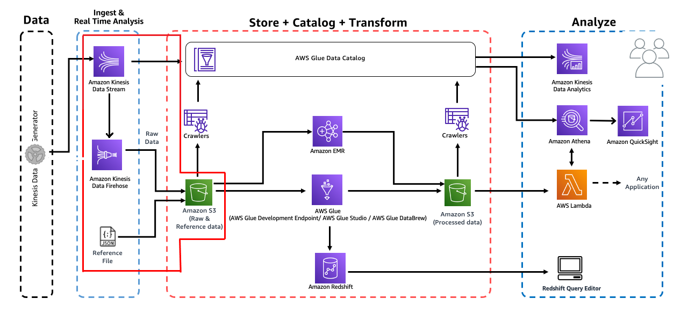

# Requirment

* Serverless Framework

# Setup

1. 下記を実行する。
    ```bash
    git clone https://github.com/maskinoshita/sls-aws-on-analytics.git`
    cd sls-aws-on-analytics-revised
    npm install
    ```

# Ingest and Store

1. `git merge origin/1-IngestAndStore`
2. `npm install`
2. `serverless.xml`の`UNIQ_PREFIX`を編集する
3. `sls deploy`
4. `sls info --verbose`を押し、`KinesisDataGeneratorUrl`に表示されたURLにブラウザでアクセスする。
5. `serverless.yml`の`custom.nested-stack`内にある、`Username`/`Password`でログインする
6. `Region:ap-northeast-1`を、`Stream/delivery stream:analytics-workshop-stream`選択し、Record templateに下記を入力する。
    ```plain
    {
        "uuid": "{{random.uuid}}",
        "device_ts": "{{date.utc("YYYY-MM-DD HH:mm:ss.SSS")}}",
        "device_id": {{random.number(50)}},
        "device_temp": {{random.weightedArrayElement(
            {"weights":[0.30, 0.30, 0.20, 0.20],"data":[32, 34, 28, 40]}
        )}},
        "track_id": {{random.number(30)}},  
        "activity_type": {{random.weightedArrayElement(
            {
                "weights": [0.1, 0.2, 0.2, 0.3, 0.2],
                "data": ["\"Running\"", "\"Working\"", "\"Walking\"", "\"Traveling\"", "\"Sitting\""]
            }
        )}}
    }
    ```
    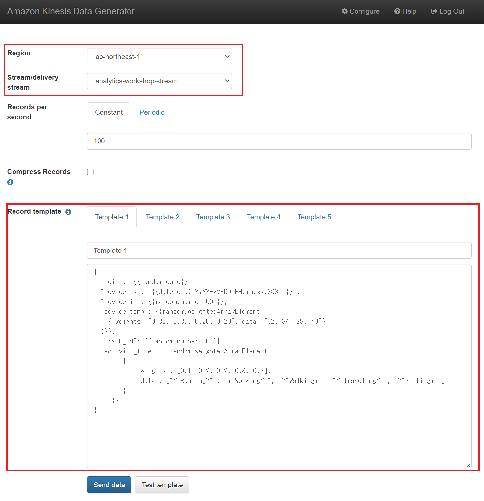
7. `Send Data`を押し、500件程度送信されたらキャンセルする。（※無限に送信するので、ストップしてください。Kinesisのデータ受信でお金がかかります。）
8. 60秒ほど待つ。(Firehoseの設定で、バッファを1MB超えるか60秒経過としているため。条件を満たすと実行して、S3に出力する)
9. [S3コンソール](https://s3.console.aws.amazon.com/s3/buckets?region=ap-northeast-1)にアクセスし、`XXX-20220819-analytics-workshop-bucket/data/raw`にアクセスする。`2022/`などパーティショニングされて出力されていればOK。
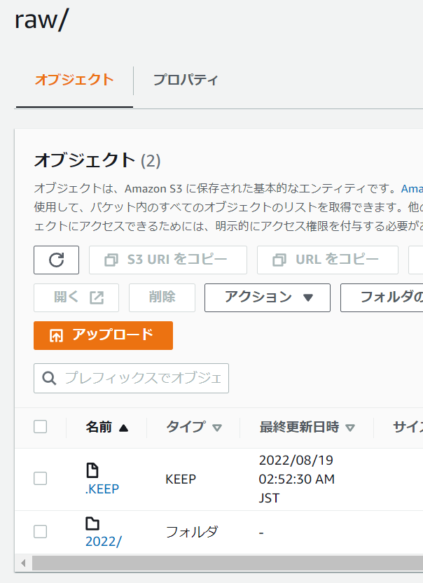

# Catalog Data

1. `git merge origin/2-CatalogData`
2. `sls deploy`
    * Firehoseのアップデートに失敗する場合は、`DeliveryStreamName`に適当な文字列を追加して、再度`sls deploy`を実行してください。
3. [Glueコンソール](https://ap-northeast-1.console.aws.amazon.com/glue/home?region=ap-northeast-1)に行き、左のペインから、`Crawlers`を選択。`AnalyticsworkshopCrawler`を選択し、`クローラの実行`を行う。
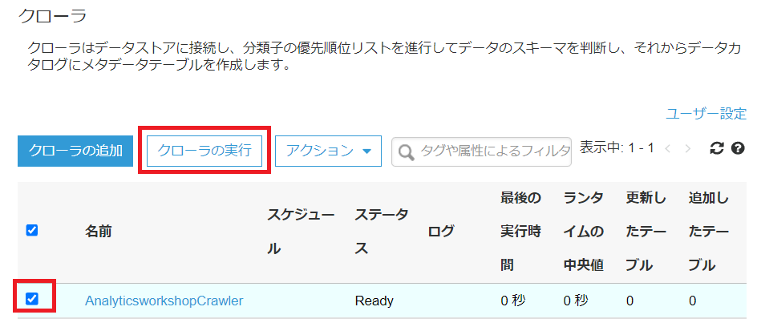
しばらく時間がかかるので、待つ。完了すると、上部に下記のようなメッセージが表示される。
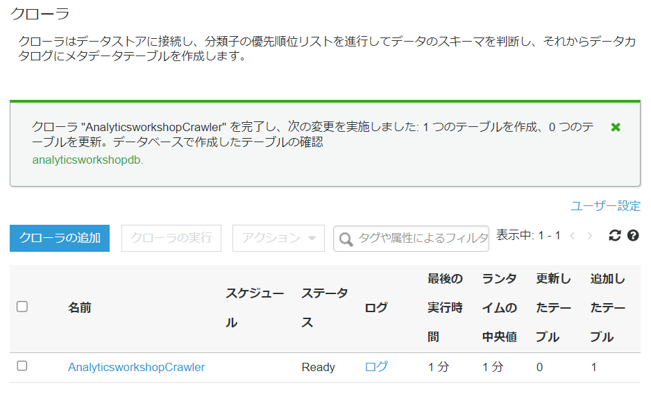
4. カタログへの登録が終わったので、クエリできるようになる。[Athenaクエリエディタ](https://ap-northeast-1.console.aws.amazon.com/athena/home?region=ap-northeast-1#/query-editor/)に行き、ワークグループを`AnalyticsWorkshop`に変更する。
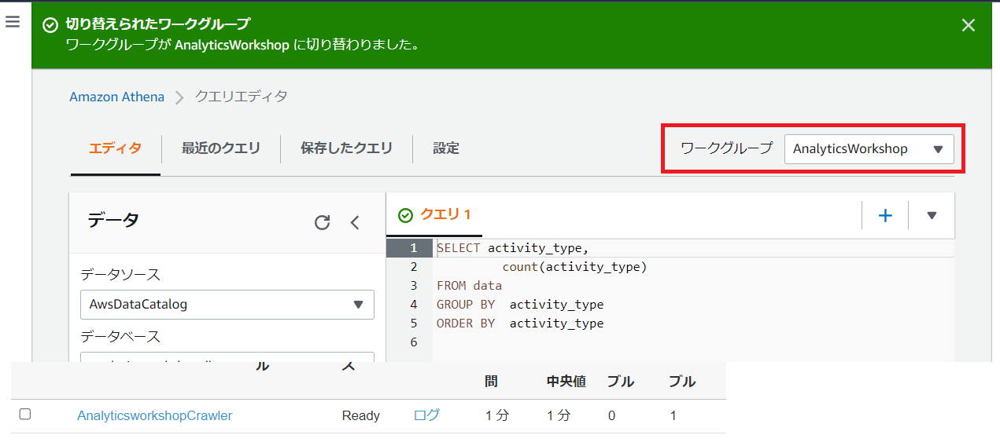
15. クエリエディタで下記を入力し、クエリを実行する。
    ```sql
    SELECT activity_type,
            count(activity_type)
    FROM raw
    GROUP BY  activity_type
    ORDER BY  activity_type
    ```

#  TransformDataWithAWS

SageMaker notebookを利用して、インタラクティブにAWS Glue(Spark)を利用する方法を紹介する。

1. `git merge origin/3-TransformDataWithAWS`
2. `sls deploy`
    * かなり時間かかるので注意
2. [Glueコンソール](https://ap-northeast-1.console.aws.amazon.com/glue/home?region=ap-northeast-1)に行き、左ペインから`Notebooks(legacy)`を選択する。`aws-glue-workshop-notebook`のリンクを開き、表示される画面から`開く`を押す。
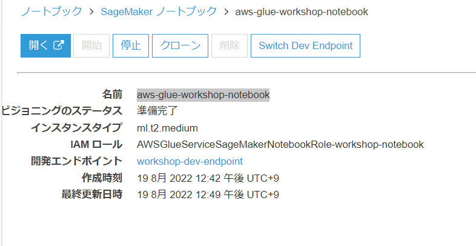
3. ノートブック上から、`Upload`を押し、リポジトリ内の`data/resource/analytics-workshop-notebook.ipynb`をアップロードする。
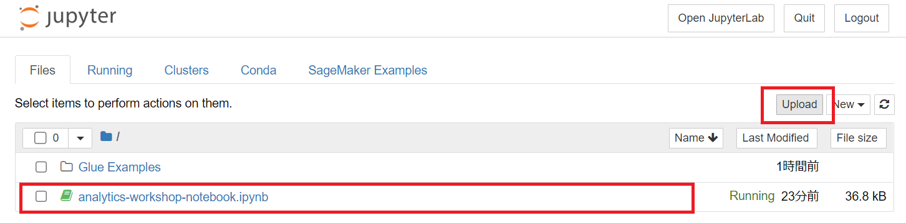
4. `analytics-workshop-notebook.ipynb`を開く
5. ノートブック上の指示に従って実行する。下記の行は変更の必要があるので注意すること。
    * Final step of the transform - Writing transformed data to S3 (後半)
        * In[18]: connection_options = {"path": "s3://XXXX/data/processed-data/"},
            - XXXX -> ${self:custom.UNIQ_PREFIX}-20220819-analytics-workshop-bucket
        * 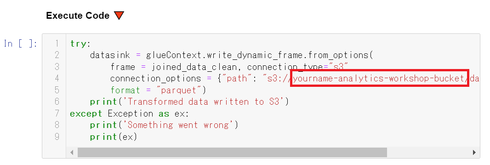
    * Add transformed data set to glue catalog (後半)
        * In[20]: glueclient = boto3.client('glue', region_name='XXXX')
            - XXXX -> ap-northeast-1
        * 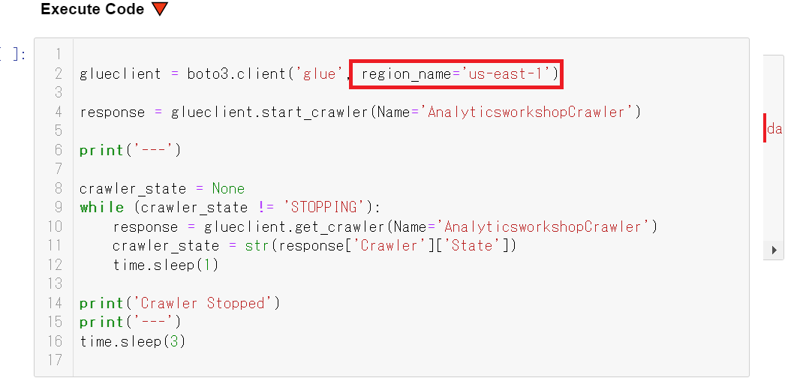

# TransformDataWithAWSGlueStudio

[元のハンズオン](https://catalog.us-east-1.prod.workshops.aws/workshops/44c91c21-a6a4-4b56-bd95-56bd443aa449/en-US/lab-guide/transform-glue-studio)を参照のこと。

タスク内容はTransformDataWithAWSと同じだが、Glue Studioを使ってビジュアルで作成する方法を紹介する。

1. [Glue Studioコンソール](https://console.aws.amazon.com/gluestudio/home?region=ap-northeast-1)に行き、左ペインからJobsを選択する。
2. Jobs(右ペイン)の`Create job`で`Visual with blank canvas`を選択する
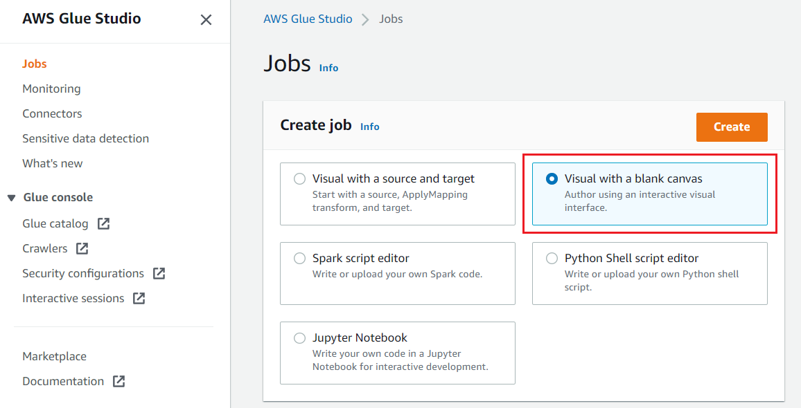
3. [元のハンズオン](https://catalog.us-east-1.prod.workshops.aws/workshops/44c91c21-a6a4-4b56-bd95-56bd443aa449/en-US/lab-guide/transform-glue-studio)を参考に、下記を実施する。
    1. 1つ目の`S3`Sourceを作成
        * Database - analyticsworkshopdb
        * Table - raw
    2. 2つ目の`S3`Sourceを作成
        * Database - analyticsworkshopdb
        * Table - reference_data
    3. `Join`Trasnsformを作成
        * Node properties -> Node Parents -> 上記のS3を２つを選択する
        * Transform -> Join Condition
            * track_id = track_id (raw <=> reference_data)
            * カラムネームの変更に対して`Resolve it`を押す (右の同じカラムにPrefixがつく)
                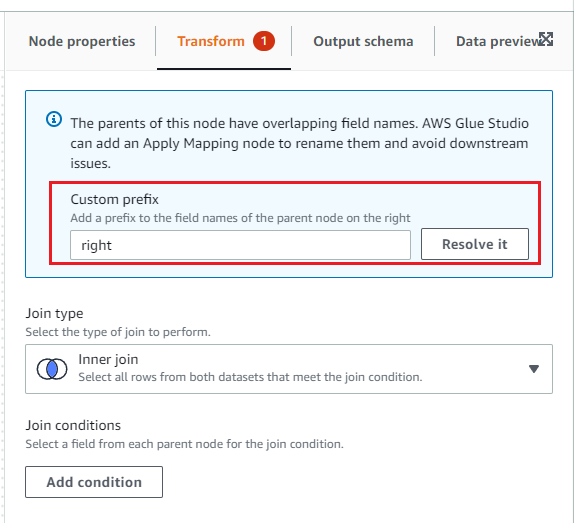
            * 追加される`Renamed keys for Join`を選択し、下記の名前の変更を戻す
                * track_name -> track_name
                * artist_name -> artist_name
    4. `Join`を選択して、`Apply Mapping`Transformを作成する
        * 下記のカラムにDropを設定する
            * partition_0
            * partition_1
            * partition_2
            * partition_3
            * (right) track_id
        * 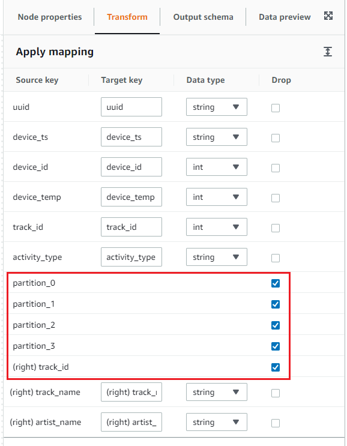
    5. `Apply Mapping`を選択して、`S3`Targetを作成する
        * *XXXX*は自分で作成したS3バケット名に`XXXX-20220819-analytics-workshop-bucket`変更してください。
        * Format: Parquet
        * Compression Type: Snappy
        * S3 Target Location: s3://XXXXX/data/processed-data2/
        * Data Catalog update options:
            - Create a table in the Data Catalog and on subsequent runs, update the schema and add new partitions
        * Database: analyticsworkshopdb
        * Table name: processed-data2
        * 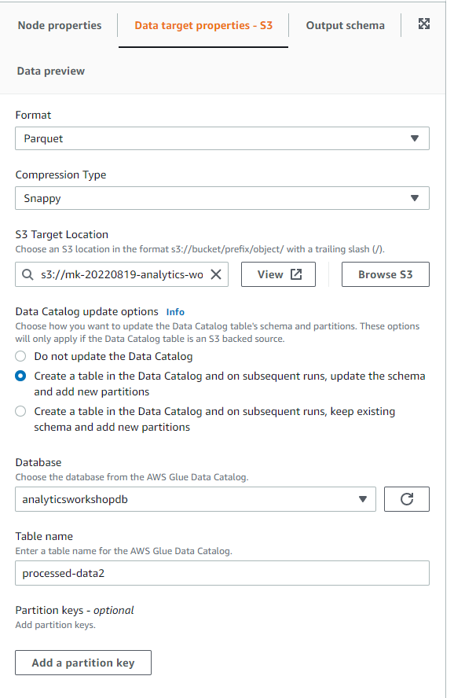
    6. 画面上部の`Job details`を選択する
        * Name: AnalyticsOnAWS-GlueStudio
        * IAM Role: AnalyticsWorkshopGlueRole
        * Requested Number of workers: 2
        * Job bookmark: Disable
        * Number of retries: 1
        * Job timeout (minutes): 10
        * Click Save
    7. 保存が成功したら、画面上部の`Run`を押す
        * 表示される`Run Details`を押す
        * 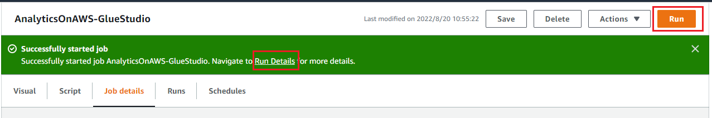
        * `Run status`が`Succeeded`になるまで待つ
        * 上記の`Script`タブで実行されたJobのコードが確認できる
            - TransformDataWithAWSのNotebookで実行したものと同等のもの
            - 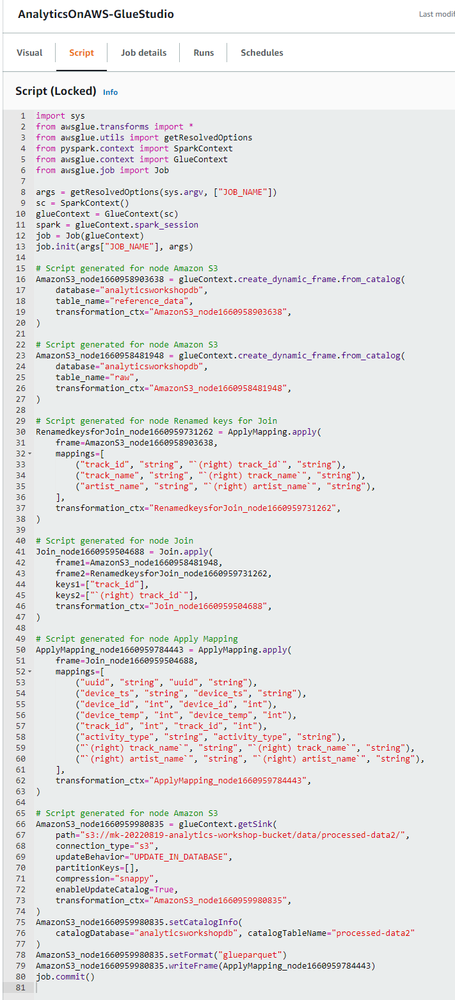
    8. [Glue コンソール](https://console.aws.amazon.com/glue/home?region=ap-northeast-1#)に行き、左ペインの`Data Catalog`の`Tables`で`processed-data2`のテーブルが作成されていることを確認する

# TransformDataWithAWSGlueDataBrew

[元のハンズオン](https://catalog.us-east-1.prod.workshops.aws/workshops/44c91c21-a6a4-4b56-bd95-56bd443aa449/en-US/lab-guide/transform-glue-databrew)を参照のこと。

1. [Glue Data Brew コンソール](https://console.aws.amazon.com/databrew/home?region=ap-northeast-1#landing)にアクセスする
2. トップページまたは左ペインのプロジェクトを選択し、`プロジェクトの作成`を押す
    * プロジェクト名: AnalyticsOnAWS-GlueDataBrew
    * `新しいデータセット`を選択
        - データセット名: raw-dataset
    * `新しいデータセットへの接続`から`全てのAWS Glueテーブル`を選択
        - `analyticsworkshopdb`をクリックし、`raw`テーブルを選択する
    * `許可`のドロップボックスから、`新しいIAMロールを作成`を選択
        - 新しいIAMロールのサフィックス: AnalyticsOnAWS-GlueDataBrew
3. `raw`テーブルのデータグリッドが表示される
4. `グリッド`のとなりの`スキーマ`を選択する
    - データの欠損やデータ型などが確認できる
5. `グリッド`を選択し、`# track_id`カラムを選択する。右の`列の詳細`にカラムの情報が表示されることを確認する。
6. `プロフィール`タブを選択し、`データプロファイル`を実行をクリックする。
    - `ジョブ出力設定`で作成したバケット(XXXX-20220819-analytics-workshop-bucket)を入力する
    - `許可`に先程作成したRoleを指定する
        - AWSGlueDataBrewServiceRole-AnalyticsOnAWS-GlueDataBrew
    - `ジョブを作成し実行`を押す
7. プロファイルには時間がかかるので、別の作業をする。`グリッド`を選択する。
8. 上部のメニューから`結合`を選択する
9. 新しいデータセットの接続を押す
    - 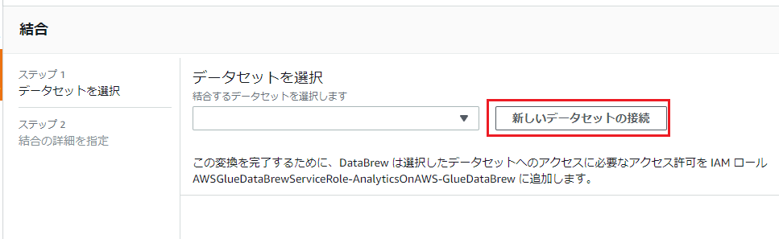
10. 下記を入力
    - `全てのAWS Glueテーブル` -> `analyticsworkshopdb` -> `reference_data`
    - データセット名: `reference-data-dataset`
    - `データセットを作成`を押す
11. `次へ`そ選択
12. `ステップ2`になっていると思うので、下記を選択する
    - 結合タイプ: 内部結合
    - 結合キー: track_id (テーブルA) <=> track_id (テーブルB)
    - 列リスト: テーブルB.track_id のチェックを外す
    - `終了`を押す
    - 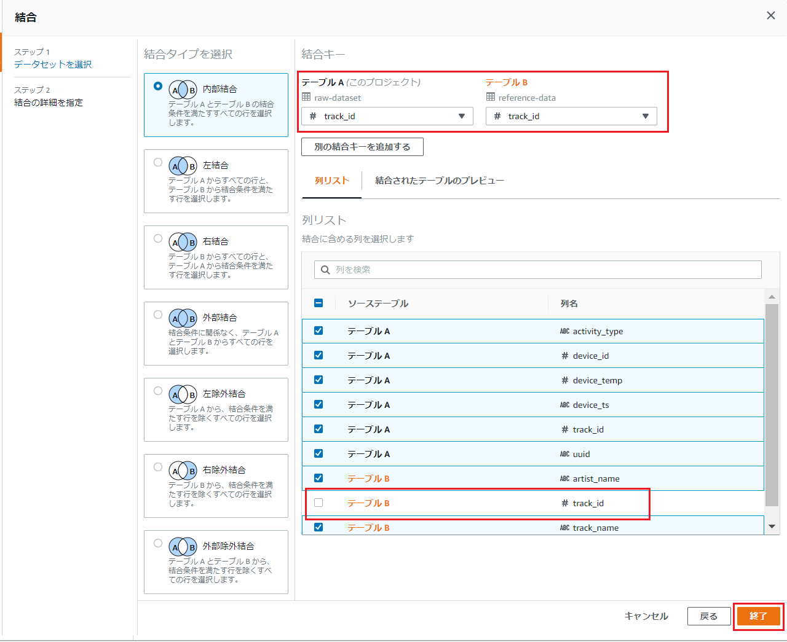
13. `プロフィール`に戻って、`raw`テーブルのプロファイルを確認する。
14. 右上の`系統`を押す。データのソースからシンクまでの流れがわかる。
    - 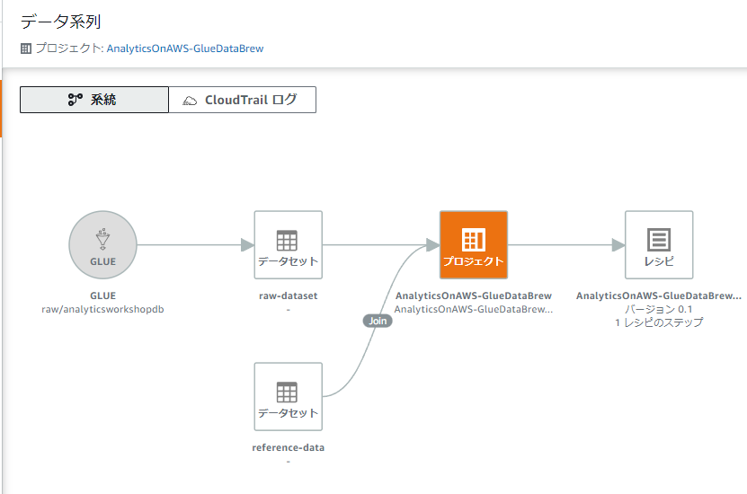
15. ブラウザの戻るなどで、`グリッド`に戻り、右上の`ジョブの作成`を押す。
    - ジョブ名: AnalyticsOnAWS-GlueDataBrew-Job
    - ジョブ出力設定
        - ファイルタイプ: GLUEPARQUET
        - S3の場所: XXXX-20220819-analytics-workshop-bucket (XXXXは書き換えてください)
        - 許可: AWSGlueDataBrewServiceRole-AnalyticsOnAWS-GlueDataBrew
    - `ジョブを作成して実行`を押す
16. `ジョブ`タブで実行中のジョブを確認できる
    - 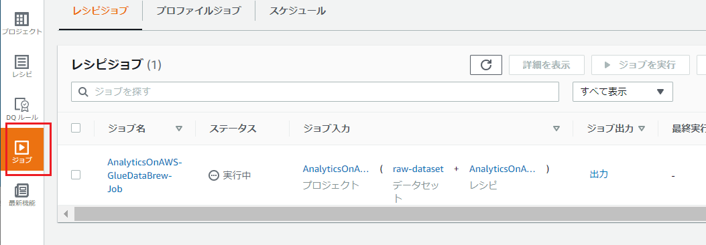
17. ジョブ完了後、`ジョブ出力`の宛先から出力結果を確認できる。
    - 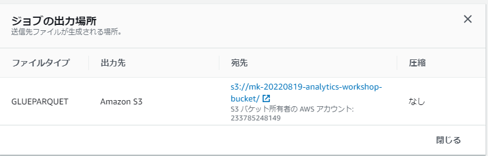
    - 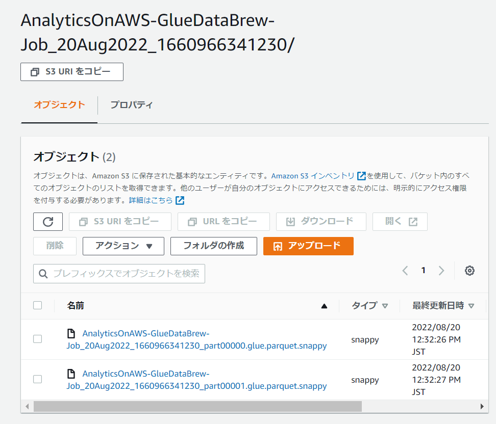

# AnalyzeWithAthena

[元のハンズオン](https://catalog.us-east-1.prod.workshops.aws/workshops/44c91c21-a6a4-4b56-bd95-56bd443aa449/en-US/lab-guide/analyze)のまま。

# Analyze with Kinesis Data Analytics

see: https://docs.aws.amazon.com/ja_jp/kinesisanalytics/latest/dev/how-it-works.html

1. `git merge origin/4-AnalyzeWithKDA`
2. `sls deploy`
3. [Kinesis Analyticsコンソール](https://ap-northeast-1.console.aws.amazon.com/kinesisanalytics/home?region=ap-northeast-1)を開く
4. `Studio`タブで準備完了になっているノートブックを実行する。注意が出るのでOKを押す。
5. `Apache Zeppelinで開く`を押す
6. `Create new note`を押す
    - 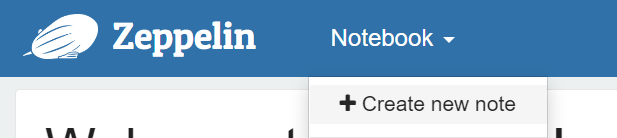
        - Note Name: AnalyticsWorkshop-ZeppelinNote
7. 行に下記を入力して、実行する。テーブルが表示される。（ストリームデータはまだ来ていないので空のまま）
    ```sql
    %flink.ssql(type=update)
    SELECT * FROM raw_stream;
    ```
8. 行(Paragraph)を追加して、下記を実行する。表示されたら、BarChartにして置く。（ストリームデータはまだ来ていないので空のまま）
    ```sql
    %flink.ssql(type=update)
    SELECT activity_type, count(*) as activity_cnt FROM raw_stream group by activity_type;
    ```
9. 行を追加して、下記を実行する。`flink.bsql`なことに注意。これはストリーム処理ではなくバッチ処理で実行している。
    ```sql
    %flink.bsql()

    CREATE TABLE tracks (
        track_id INT,
        track_name VARCHAR(255),
        artist_name VARCHAR(255)
    ) WITH (
        'connector' = 'filesystem',
        'path' = 's3://mk-20220819-analytics-workshop-bucket/data/reference_data/',
        'format' = 'json'
    )
    ```
    see: https://nightlies.apache.org/flink/flink-docs-master/docs/connectors/table/filesystem/
10. 行を追加して、下記を実行する。`flink.ssql`なことに注意。これはストリーム処理になる。この処理では、バッチ処理で読み込んでおいたテーブルと、ストリームで追加されたデータをリアルタイムで結合している。
    ```sql
    %flink.ssql(type=update)

    SELECT
        activity_type, device_id, device_temp, raw_stream.track_id, uuid, track_name, artist_name
    FROM raw_stream
    INNER JOIN tracks
    ON raw_stream.track_id = tracks.track_id;
    ```

* メモ: データの量が少ない場合、Kinesis Data Streams -> Lambda でのストリーム処理のほうが楽かも。Flink vs. Lambdaのインフラコスト、スループット、レイテンシは要検討。
    - Flink
        - ストリームデータが来なくても、インフラコストがかかる
        - コールドスタートの影響がなく、高スループットかつ低レイテンシ
    - Lambda
        - ストリームデータが来ない場合、インフラコスト0
        - コールドスタートによる影響で、低スループットかつ高レイテンシ

# Clean up

手動で作成したリソースは`sls remove`で消えないので手動で削除する

1. `sls remove`
2. `bash nested-stacks/clean-kinesis-data-generator.sh`
    - cognito userpool/identity poolを削除する
3. 手動削除
    * [Glue Studio Jobs](https://ap-northeast-1.console.aws.amazon.com/gluestudio/home?region=ap-northeast-1#/jobs)
        - `AnalyticsOnAWS-GlueStudio`にチェックを入れて、Actions->Delete Job(s)
    * [Glue DataBrew Projects](https://console.aws.amazon.com/databrew/home?region=ap-northeast-1#projects)
        - `AnalyticsOnAWS-GlueDataBrew`にチェックを入れて、アクション->削除
            - アタッチされたレシビを削除にチェック
            - 削除を押す
    * [Glue DataBrew Dataset](https://console.aws.amazon.com/databrew/home?region=ap-northeast-1#datasets)
        - 全てのデータセットにチェックを入れて、アクション->削除
    * [Glue DataBrew Profile](https://console.aws.amazon.com/databrew/home?region=ap-northeast-1#jobs?tab=profile)
        - ` raw-dataset profile job`にチェックをいれて、アクション->削除
    * [IAM](https://console.aws.amazon.com/iam/home?region=ap-northeast-1#/roles)
        - `AWSGlueDataBrewServiceRole-*`

# Appendix

## 積み残し

* 自動化
    - パターン1: S3 Notification -> SQS -> Crawler (クローラのみ)
        - https://aws.amazon.com/jp/about-aws/whats-new/2021/10/aws-glue-crawlers-amazon-s3-notifications/
        - https://docs.aws.amazon.com/ja_jp/glue/latest/dg/crawler-s3-event-notifications.html
    - パターン2: EventBridge (バッチ処理部の自動化)
        1. Firehose -> EventBridge -> Crawler (raw)
        2. Cloudwatch Event (Crawler(raw)) -> EventBridge -> Glue Job
        3. GlueJob -> EventBridge -> Crawler (processed)
        4. CloudWatch Event (Crawler(processed)) -> EventBridge -> Lambda 
    - パターン3: EventBridge + StepFunctions (バッチ処理部の自動化)
        - https://docs.aws.amazon.com/ja_jp/lambda/latest/dg/services-kinesisfirehose.html
        1. Firehose -> EventBridge -> StepFunction
        2. StepFunction
            1. Wait (few minutes to complete writing S3)
            2. Start Clawler (raw)
            3. Wait Crawler(raw) done
            4. Start Glue Job
            5. Wait Glue Job done
            6. Start Crawler (processed)
            7. Wait Crawler (processed) done
            8. Notify batch update done to Lambda
* Kinesis Data Analytics Studioのノートブックで書いたJobのDurable化
    - Notebookに書いたジョブをロングランニングなジョブに変換できる
        - https://docs.aws.amazon.com/kinesisanalytics/latest/java/how-notebook-durable.html
        - https://docs.aws.amazon.com/kinesisanalytics/latest/java/example-notebook-deploy.html
* Lambda Architecture
    - Speed Layer (Kinesis Data Analytics) と Batch Layer (Glue Job)を結合する
        - Speed Layer と Batch Layerのオーバラップを検討する
            - https://dev.classmethod.jp/articles/kinesis-data-analytics-timestamp-and-window-query-pattern/
        - Speed Layerはウインドウを使って、Batch Layerの値と結合する
            - SpeedLayerがBatch Layerで処理した部分とオーバラップ/オーバラップしなかった部分が、真値よりも大きい/小さいものとして現れる
            - アプリケーションとしてどのような誤差許容されるかによって使用を検討する
            - Batch Layerは後追いでこの誤差を解消する
        - 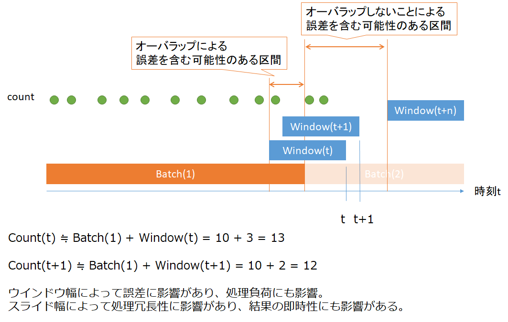

## Analytics

```sql
%flink.bsql()

CREATE TABLE tracks (
    track_id INT,
    track_name VARCHAR(255),
    artist_name VARCHAR(255)
) WITH (
    'connector' = 'filesystem',
    'path' = 's3://mk-20220819-analytics-workshop-bucket/data/reference_data/',
    'format' = 'json'
)
```

```sql
%flink.ssql()

CREATE TEMPORARY VIEW aggregated AS
        SELECT A.track_id as track_id, track_name, artist_name, activity_type, cnt
        FROM
            tracks AS A,
            (
                SELECT track_id, activity_type, COUNT(device_id) as cnt
                FROM raw_stream
                GROUP BY track_id, activity_type, HOP(device_ts, INTERVAL '10' second, INTERVAL '2' minute)
            )  AS B
        WHERE
          A.track_id = B.track_id
```

```python
%flink.pyflink()

from pyflink.table import *
from pyflink.table.expressions import col

table = st_env.from_path("aggregated") # get view defined by ssql
# z.show(table, stream_type="update") # show in zeppelin notebook
```

TODO:
    kinesis-analytics -> kinesis datastream -> lambda
Refs:
    - https://noise.getoto.net/2022/04/13/query-your-data-streams-interactively-using-kinesis-data-analytics-studio-and-python/
